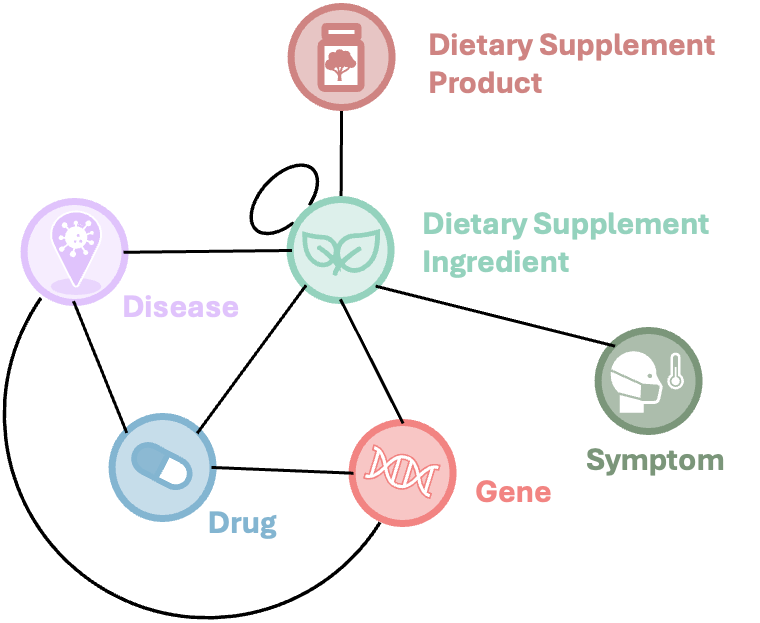

# eDISK: An Enriched Dietary Supplement Knowledgebase

**eDISK** is an enriched version of [iDISK](https://github.com/houyurain/iDISK2.0), the integrated Dietary Supplement Knowledgebase[1]. The goal of eDISK is to provide a more comprehensive and diverse resource for dietary supplement (DS) knowledge by integrating information from a variety of public, literature-based, and real-world data sources.

## 🔍 Overview

eDISK extends iDISK by incorporating additional resources and data modalities. It aims to support research and applications involving dietary supplements, including safety, efficacy, interactions, and adverse events.
The following diagram illustrates the overall schema of eDISK and how its components are integrated:

  

## 📚 Data Sources

eDISK is built from the integration of the following key resources:

1. **Public Databases**
   - [About Herbs](https://www.mskcc.org/cancer-care/diagnosis-treatment/symptom-management/integrative-medicine/herbs) from the Memorial Sloan Kettering Cancer Center (MSKCC)
   - [Dietary Supplement Label Database (DSLD)](https://dsld.od.nih.gov/)
   - [Licensed Natural Health Products Database (LNHPD)](https://health-products.canada.ca/lnhpd-bdpsnh/index-eng.jsp)

2. **SuppKG**  
   A literature-derived knowledge graph of dietary supplement-related knowledge constructed using NLP techniques[2].

4. **Social Media Mining**  
   Dietary supplement-related knowledge extracted from Twitter using natural language processing.

5. **Database of Dietary Supplement Adverse Events ([DDSAE](https://github.com/zhang-informatics/DDSAE))**  
   A collection of DS-adverse event signals derived from the CFSAN Adverse Event Reporting System (CAERS). Includes adverse events associated with both dietary supplement products and ingredients.

6. **[Supp.AI](https://supp.ai/)**  
   An automated system that extracts evidence of supplement–drug interactions from scientific literature[3].

## 📑 References

[1] Hou Y, Bishop JR, Liu H, Zhang R. Improving Dietary Supplement Information Retrieval: Development of a Retrieval-Augmented Generation System With Large Language Models. J Med Internet Res. 2025 Mar 19;27:e67677. doi: 10.2196/67677. PMID: 40106799; PMCID: PMC11966073.

[2] Schutte D, Vasilakes J, Bompelli A, Zhou Y, Fiszman M, Xu H, Kilicoglu H, Bishop JR, Adam T, Zhang R. Discovering novel drug-supplement interactions using SuppKG generated from the biomedical literature. J Biomed Inform. 2022 Jul;131:104120. doi: 10.1016/j.jbi.2022.104120. Epub 2022 Jun 13. PMID: 35709900; PMCID: PMC9335448.

[3] Wang, L.L., Tafjord, O., Cohan, A., Jain, S., Skjonsberg, S., Schoenick, C., Botner, N. and Ammar, W., 2019. SUPP. AI: finding evidence for supplement-drug interactions. *arXiv preprint*, 2019. *arXiv:1909.08135*.
